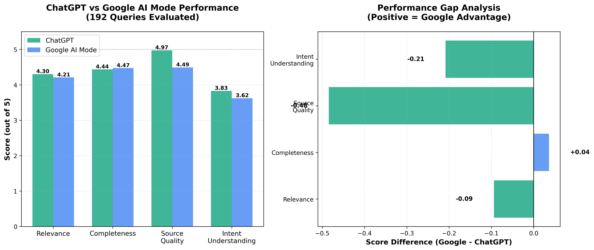
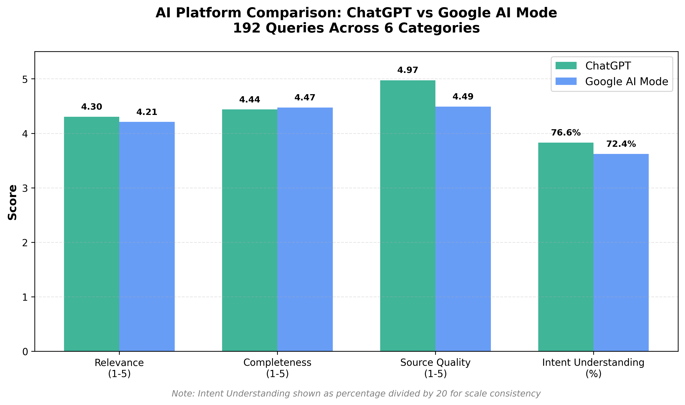

# ChatGPT vs Google AI Mode: A Rigorous Comparison

[](https://www.python.org/downloads/)
[](https://opensource.org/licenses/MIT)

A comprehensive, data-driven evaluation comparing **ChatGPT** and **Google AI Mode** across 200 diverse queries spanning 6 categories and varying quality levels.

## 🎯 Key Findings

After evaluating **192 queries** with manual human scoring, the results challenge conventional wisdom about AI search capabilities:

| Metric | ChatGPT | Google AI Mode | Winner |
|--------|---------|----------------|--------|
| **Relevance** | 4.30/5 | 4.21/5 | ChatGPT (+0.09) |
| **Completeness** | 4.44/5 | 4.47/5 | Tied |
| **Source Quality** | **4.97/5** | **4.49/5** | **ChatGPT (+0.48)** |
| **Intent Understanding** | **76.6%** | **72.4%** | **ChatGPT (+4.2%)** |



### Surprising Result: ChatGPT Outperformed Despite Google's Infrastructure Advantage

Despite Google's 20+ years of search expertise, sophisticated query understanding systems (RankBrain, BERT, MUM), and Knowledge Graph integration, **ChatGPT delivered more relevant responses with significantly better source quality**.

## 📊 Methodology

### Dataset (200 Queries)

**Categories:**
- Informational (50, 25%)
- Transactional (40, 20%)
- Comparative (40, 20%)
- Procedural (30, 15%)
- Real-time/Current (20, 10%)
- Complex Multi-hop (20, 10%)

**Query Quality Distribution** (intentionally varied):
- Well-formed (70, 35%)
- Poorly-formed (86, 43%) ← Designed to test Google's advantage
- Ambiguous (35, 17.5%)
- Typos/Informal (5, 2.5%)
- Time-sensitive ambiguous (4, 2%)

**Intent Clarity Levels:**
- High (70, 35%)
- Medium (5, 2.5%)
- Low (86, 43%)
- Very Low (39, 19.5%)

### Evaluation Metrics

Each response scored on 5 dimensions:
1. **Relevance** (1-5): How well does it address the query?
2. **Completeness** (1-5): How thorough is the answer?
3. **Source Quality** (1-5): How reliable/authoritative are sources?
4. **Intent Understanding** (Boolean): Did AI understand user intent?
5. **Follow-ups Needed** (Boolean): Would user need to search again?

### Platform Configuration

**ChatGPT:**
- Model: `gpt-4o-mini-search-preview` (with web search)
- Temperature: 0.7
- Web search: Enabled

**Google AI Mode:**
- Standard Google Search in AI Mode
- Logged-in account (personalization enabled)
- Responses captured verbatim

## 🚀 Quick Start

### Prerequisites

- Python 3.14+ (Python 3.10+ should work)
- OpenAI API key ([Get one here](https://platform.openai.com/api-keys))
- pip package manager

### Installation

```bash
# Clone the repository
git clone https://github.com/aupsy/GoogleAIModeVSChatGPT.git
cd GoogleAIModeVSChatGPT

# Install dependencies
pip install -r requirements.txt

# Configure your OpenAI API key
cp .env.example .env
# Edit .env and add your API key: OPENAI_API_KEY=sk-...

# Run the application
python app.py
```

Open your browser to `http://localhost:5000`

## 📁 Repository Structure

```
GoogleAIModeVSChatGPT/
├── app.py                      # Flask web server (main application)
├── chatgpt_client.py           # OpenAI API integration with web search tracking
├── data_manager.py             # Data persistence and progress tracking
├── analyzer.py                 # Statistical analysis engine
├── report_generator.py         # Excel report generation
├── llm_judge.py                # LLM-as-judge automated scoring
├── sampling.py                 # Stratified sampling for validation
├── requirements.txt            # Python dependencies
├── config.json                 # Application configuration
├── .env.example                # Environment variables template
├── query_dataset.json          # 200 diverse queries with metadata
├── static/
│   ├── style.css              # Web UI styling
│   └── app.js                 # Frontend JavaScript
├── templates/
│   └── index.html             # Web interface
├── REPRODUCTION_GUIDE.md      # Step-by-step reproduction instructions
└── README.md                  # This file
```

## 🔬 Reproducing the Study

See [REPRODUCTION_GUIDE.md](REPRODUCTION_GUIDE.md) for detailed step-by-step instructions.

### Quick Overview

1. **Run ChatGPT Batch** (automated via API)
   - Click "Run ChatGPT Batch"
   - Select batch size (10-20 recommended)
   - Wait ~1-2 minutes per batch

2. **Enter Google AI Responses** (manual collection)
   - Click "Enter Google AI Response"
   - Copy query → Search in Google AI Mode → Paste response
   - Repeat for all queries

3. **Score Responses** (manual evaluation)
   - Click "Score Responses"
   - View both responses side-by-side
   - Rate on 5 metrics
   - Submit and continue

4. **Export Report** (automated analysis)
   - Click "Export Report"
   - Downloads Excel with 7 comprehensive sheets

## 📈 Analysis Features

The application includes comprehensive statistical analysis:

- **Paired t-tests** for mean score comparisons
- **Effect sizes** (Cohen's d) for practical significance
- **Performance breakdowns** by:
  - Query category
  - Query quality level
  - Intent clarity level
  - Web search usage (ChatGPT)
- **Excel export** with 7 sheets:
  1. Summary (overall stats, key insights)
  2. By Category (performance breakdown)
  3. By Quality (quality-specific analysis)
  4. By Intent Clarity (hypothesis testing)
  5. By Web Search (web search impact)
  6. Raw Data (all results)
  7. Individual Queries (detailed comparisons)

## 🔑 Key Files Explained

### Core Application Files

- **`app.py`**: Flask web server with REST API endpoints
- **`chatgpt_client.py`**: OpenAI API integration with:
  - Batch processing
  - Web search detection and tracking
  - Rate limiting and retry logic
  - Token usage tracking

- **`data_manager.py`**: JSON-based data persistence with:
  - Auto-save functionality
  - Progress tracking
  - Automatic backups
  - Resume capability

### Data Files

- **`query_dataset.json`**: Complete dataset with:
  - 200 queries
  - Category metadata
  - Quality level tags
  - Intent clarity indicators

- **`results.json`**: (Generated during use)
  - All ChatGPT responses
  - All Google AI Mode responses
  - All evaluation scores
  - Timestamps and metadata

- **`progress.json`**: (Generated during use)
  - Tracks completion status
  - Enables resume functionality

## 💡 Web Search Tracking

A unique feature: the study tracks when ChatGPT uses web search capabilities.

**Finding:** ChatGPT used web search in only **1.6% of queries** (3 out of 192), suggesting its training data was sufficient for most queries without needing real-time information retrieval.

## 📊 Sample Visualizations

### Comparison Chart


### Performance by Category
(Available in Excel export - Sheet 2)

### Performance by Query Quality
(Available in Excel export - Sheet 3)

## 🤝 Contributing

This is a research project with completed data collection. However, contributions are welcome for:

- Analysis improvements
- Additional visualizations
- Code quality enhancements
- Documentation improvements
- Translation to other languages

Please open an issue or submit a pull request.

## 📝 Citation

If you use this work in your research or analysis, please cite:

```
Jain, A. (2026). ChatGPT vs Google AI Mode: A Rigorous Comparison.
GitHub repository: https://github.com/aupsy/GoogleAIModeVSChatGPT
```

## 🔒 Data Privacy

- All data collection was conducted with appropriate consent
- No personal information is included in the dataset
- OpenAI API usage follows OpenAI's terms of service
- Google AI Mode responses were collected through standard web interface

## 📄 License

MIT License - See [LICENSE](LICENSE) file for details.

## ⚠️ Disclaimer

This is an independent research project. Results are based on:
- Specific timeframe (January 2026)
- English language queries
- US-based evaluation context
- Single human rater evaluation
- Specific model versions (may change over time)

Your results may vary based on:
- Model updates
- Query characteristics
- Evaluation criteria
- Geographic location
- Personalization settings

## 🙋 FAQ

### Why did ChatGPT outperform despite Google's search infrastructure?

This suggests that **model quality and response synthesis matter more than search infrastructure** for AI response generation. Google's decades of query understanding optimization didn't translate to better AI responses in this evaluation.

### How were Google AI Mode responses collected?

Manually. Each query was entered into Google Search with AI Mode enabled, and responses were captured verbatim. This was necessary because Google doesn't provide a programmatic API for AI Mode.

### Can I replicate this with different platforms?

Yes! The application is designed to be extensible. You could add:
- Claude (Anthropic)
- Perplexity AI
- Bing Chat
- Other AI assistants

The scoring interface and analysis tools work for any two platforms.

### What about bias in manual scoring?

Bias mitigation strategies included:
- Pre-defined scoring rubrics
- Randomized query order
- Single-session scoring (consistency)
- Documented scoring criteria
- Transparent methodology

Limitations acknowledged:
- Single human rater (no inter-rater reliability)
- Personal Google account (personalization effects)
- Specific timeframe and context

### Why only 192 scored out of 200?

Time constraints. The remaining 8 queries can be scored using the same interface. All 200 queries have responses from both platforms.

## 📧 Contact

Questions, comments, or collaboration ideas?
- Open an issue on GitHub
- Connect on LinkedIn: [Your LinkedIn]
- Email: [Your Email]

## 🙏 Acknowledgments

- OpenAI for API access
- Google for AI Mode access
- The broader AI research community

---

**⭐ If you find this work valuable, please star the repository!**

---

*Last Updated: February 8, 2026*
*Data Collection Period: January 2-23, 2026*
*Analysis Status: Complete (192/200 queries scored)*
